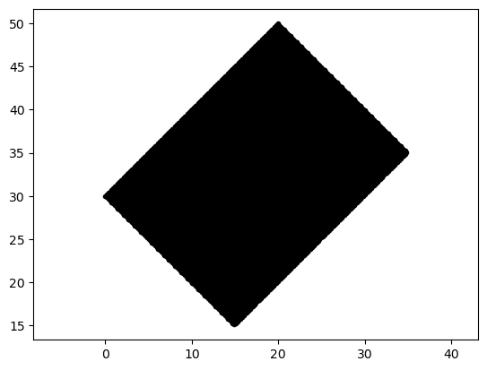
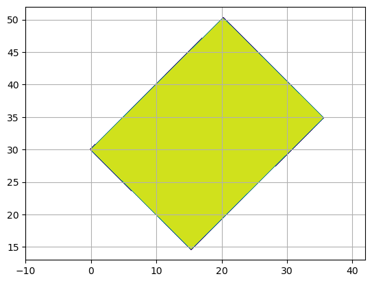

# Overview of Models

There are currently three models on the bench:

- FESOM
- NEMO
- ICON

The common configuration is called **DBGYRE** which is an idealised configuration to be used with different numerical ocean models. It was first introduced as a "*Double-Gyre*" configuration by [Levy et al. (2010)][Levy2010-cite] using the [NEMO][NEMO-www] ocean model. It was then adapted and refined for and implemented into [FESOM][FESOM-www] ocean model as "*toy_dbgyre*" by [Ekatarina Bagaeva et al. (2024)][Ekatarina-cite]. 

The *DBGYRE* configuration and the model specifics provided by this project have been modified in such a way that the resulting outcomes are as similar as possible between the three model branches *FESOM*, *NEMO* and ICON that are currently supported.


The general characteristics of *DBGYRE* are[^change]:

- Basin: Closed rectangular basin rotated by 45˚ of fixed size but of varying grid resolution  

    |                          **FESOM**                           |                           **NEMO**                           | **ICON** |
    | :----------------------------------------------------------: | :----------------------------------------------------------: | -------- |
    |  |  |          |

     

    - Spherical coordinates
    - Corners are located at (in clockwise direction starting at the northern most corner):
        - **North**: 50˚N, 20˚E (also: 65˚W)
        - **East**: 35˚N, 35˚E (also: 50˚W) 
        - **South**: 15˚N, 15˚E (also: 70˚W)
        - **West**: 30˚N, 0˚E (also: 85˚W)

- Linearised equation of state  (see appendix below)
- Coriolis $\beta$-plane  (see appendix below)

- Flat bottom
- Vertical mixing is based on Richardson number ([Pacanowski & Philander (1981)](PP1981-cite))
- The lateral boundary condition set to *free-slip*
- Linear bottom drag
- Forcing
  - no freshwater forcing
  - heat flux via relaxation toward prescribed temperature (see appendix below)


Details can be found in each model-specific document

- [FESOM](fesom.md)
- [NEMO](nemo.md)
- [ICON](icon.md)


[^change]: Might be object to experiment-specific changes.


## Appendix


### Linearised equation of state

``` math
\rho = \rho_0 - \rho_0*0.0002052*(T-T_0) + \rho_0*0.00079*(S - S_0)
```

with $\rho_0=1030.0\ kg/m^3$ $T_0=10.0˚C$ and $S_0 = 35.0\ psu$.  

**NOTE**: Since salinity is initialised with $S=S_0$, the density change due to salinity differences cancels out.  


### Coriolis Beta Plane

``` math
f = f_0 + \beta y \\[1em]

```

where $f_0 = 2\Omega sin(\phi_0) = 1.0\times 10^{-4}$ and

``` math
\beta = 2\Omega\ cos(\phi_0)/R_a \\[1em]
```

with $\Omega = 7.292\times10^{−5}\ \mbox{rad/s}$, $\phi_0 = 38˚$ and $R_a=6367500m$ resulting in $\beta = 1.8\times 10^{-11}$, while the meridional distance $y$ can by expresses in terms of the horizontal (zonal) distance for one degree at the equator:  

``` math
y = (\phi - \phi_0)\frac{2\pi R_a}{360}
```

which, by introducing $rad = \pi/180$ (which is also the conversion factor from degree to radiant), turns to:  

``` math
y = (\phi - \phi_0)*rad*R_a
```

### Atmospheric Heat Forcing

The heat flux $Q_H$ is computed via a relaxation towards a prescribed air temperature $T^*$ with a constant nudging parameter $z_{trp} = 4.0$:

``` math
Q_H = z_{trp} * (T - T^*)
```

Air temperature should be prescribed by:

``` math
T_{atm} = T_0 * \cos(\phi^*)
```

in such a way that

```
Lat | T_star
==================
50N |  7.0˚C
  : |    :
15N | 27.0˚C approx.
10N | 28.3˚C
```

The proposed solution for the atmospheric temperature to be used in the temperature restoring term from Levy (2010) is following Bagaeva (2024):

``` math
T_{atm} = T_0 * \cos\left( (\phi - 5) * \mu \right)
```

with $T_0 = 28.3˚C$ and $\phi$ being the latitude and $\mu \approx 1.68$ a weight factor.

This weight factor $\mu$ scales the latitude argument in the cos function in such a way that with the given $T_0$ the air temperatur is 7˚C at 50N:

``` math
28.3˚C * \cos\left( (50-5) * \mu \right) = 7˚C
```

This equation can be solved by $\mu$:

``` math
\begin{eqnarray*}
\cos\left( (50-5) * \mu \right) &= &\frac{7˚C}{28.3˚C} \\
(50-5) * \mu  &= & cos^{-1}\left( \frac{7˚C}{28.3˚C} \right) \\
\mu &= & \frac{ cos^{-1}\left( \frac{7˚C}{28.3˚C} \right) }{ (50-5) }
\end{eqnarray*}
```


Please note, that the cosine function in Fortran `cos()` expects its argument in units of radiants. Thus we need a conversion:


``` math
T_{atm} = T_0 * \cos_{rad}\left( \frac{\pi}{180} (\phi - 5) * \mu \right)
```


With $\mu / 180 = 1.68176125 \approx 1/107$ this leads to :

``` math
T_{atm} = T_0 * \cos_{rad}\left( \pi \frac{(\phi - 5)}{107} \right)
```


and to the the Fortran code snippet from FESOM:

``` fortran
t_atm = T0 * cos(  pi * ( ( lat - 5.0 ) / 107.0 ) )
```


[NEMO-www]: https://www.nemo-ocean.eu

[FESOM-www]: https://fesom.de


[Ekatarina-cite]: https://doi.org/10.1029/2023MS003972 "Bagaeva, E., Danilov, S., Oliver, M., & Juricke, S. (2024). Advancing eddy parameterizations: Dynamic energy backscatter and the role of subgrid energy advection and stochastic forcing. Journal of Advances in Modeling Earth Systems, 16, e2023MS003972. https://doi.org/10.1029/2023MS003972"

[Levy2010-cite]: https://doi.org/10.1016/j.ocemod.2010.04.001 "M. Lévy, P. Klein, A.-M. Tréguier, D. Iovino, G. Madec, S. Masson, K. Takahashi (2010). Modifications of gyre circulation by sub-mesoscale physics. Ocean Modelling, vol. 34, issue 1-2. https://doi.org/10.1016/j.ocemod.2010.04.001"

[PP1981-cite]: https://doi.org/10.1175/1520-0485(1981)011¡1443:POVMIN¿2.0.CO;2 "Pacanowski, R. C., & Philander, S. G. H. (1981). Parameterization of vertical mixing in numerical models of tropical oceans. Journal of Physical Oceanography, 11(11), 1443–1451. https://doi.org/10.1175/1520-0485(1981)011¡1443:POVMIN¿2.0.CO;2"

